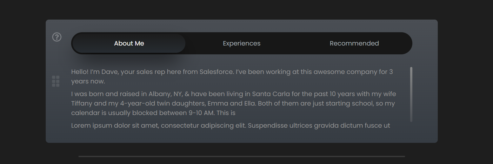
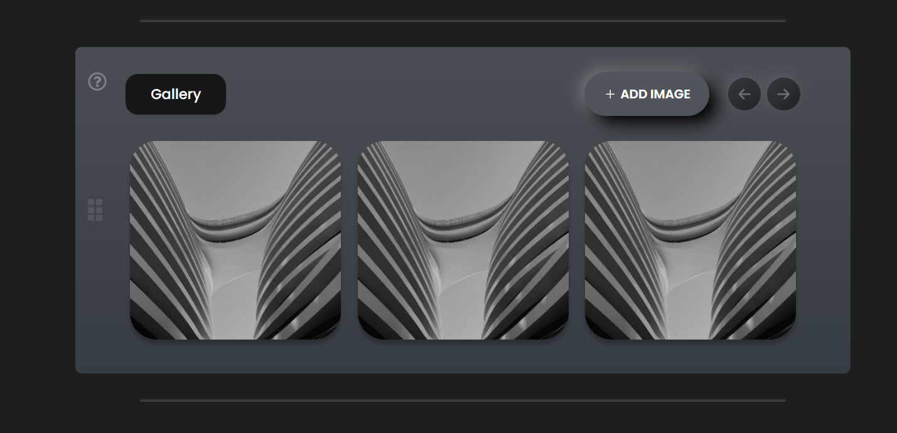

# Assignment Lunacal

This project, **Assignment Lunacal**, is a dynamic and responsive web application designed to showcase various features such as tab navigation, image sliders, and image management through both URLs and local files. The application is built with modern web technologies, ensuring a smooth and engaging user experience.

## Technologies Used

- **React:** A popular JavaScript library for building user interfaces, allowing for component-based architecture and efficient rendering.
- **Vite:** A fast and modern build tool optimized for frontend development, offering instant server start, hot module replacement, and optimized production builds.
- **Tailwind CSS:** A utility-first CSS framework that allows for rapid UI development with predefined classes and customizable design.
- **React Icons:** A library of popular icons integrated seamlessly with React, providing a wide range of icons for use in your application.
- **Swiper JS:** A modern touch slider library with rich features such as custom navigation, pagination, and responsive slides.

## Features

- **Tab Section:** A navigable tab interface allowing users to switch between different sections like "About Me," "Experiences," and "Recommended," each with smooth transitions.
- **Image Slider:** A responsive and interactive image slider with custom navigation, allowing users to view images seamlessly with swipe gestures.
- **Add Images by URL and Local:** Users can add images to the gallery either by providing a URL or uploading from their local files, with options for editing and deleting images.

## How to Install and Run Locally

This project is built using Vite and React. Follow the steps below to run it locally:

1. Clone the repository:
   ```bash
   git clone https://github.com/amankashyap004/assignment-lunacal.git
   ```
2. Navigate to the project directory:
   ```bash
   cd assignment-lunacal
   ```
3. Install dependencies:
   ```bash
   npm install
   ```
4. Start the development server:
   ```bash
   npm run dev
   ```
5. Open your browser and go to `http://localhost:5173` to see the application in action.

## Screenshots

Below are some screenshots showcasing the features and design of the application:




## Live Demo and Repository

- Live Demo: **[Assignment Lunacal](https://assignment-lunacal-alpha.vercel.app/)**
- GitHub Repository: **[Assignment Lunacal](https://github.com/amankashyap004/assignment-lunacal)**

## Folder Structure

The project is organized as follows:

```base
ASSIGNMENT-LUNACAL/
├── node_modules/
├── public/
│   ├── default1.png
│   ├── favicon.ico
│   ├── screenshot1.png
│   └── screenshot2.png
├── src/
│   ├── components/
│   │   ├── AddImagePopup.jsx
│   │   ├── CustomContainer.jsx
│   │   ├── GalleryWidget.jsx
│   │   └── TabWidget.jsx
│   ├── App.css
│   ├── App.jsx
│   ├── index.css
│   ├── main.jsx
├── .gitignore
├── eslint.config.js
├── index.html
├── package-lock.json
├── package.json
├── postcss.config.js
├── README.md
├── tailwind.config.js
└── vite.config.ts
```

## Future Enhancements

- **Better Color Combination:** Enhance the design with a more appealing color palette to improve the visual aesthetics of the application.
- **More Sections:** Expand the application by adding more sections and features to provide a richer user experience.
- **Animations:** Implement animations to create a more dynamic and engaging user interface.

Feel free to contact me for any queries or suggestions.
